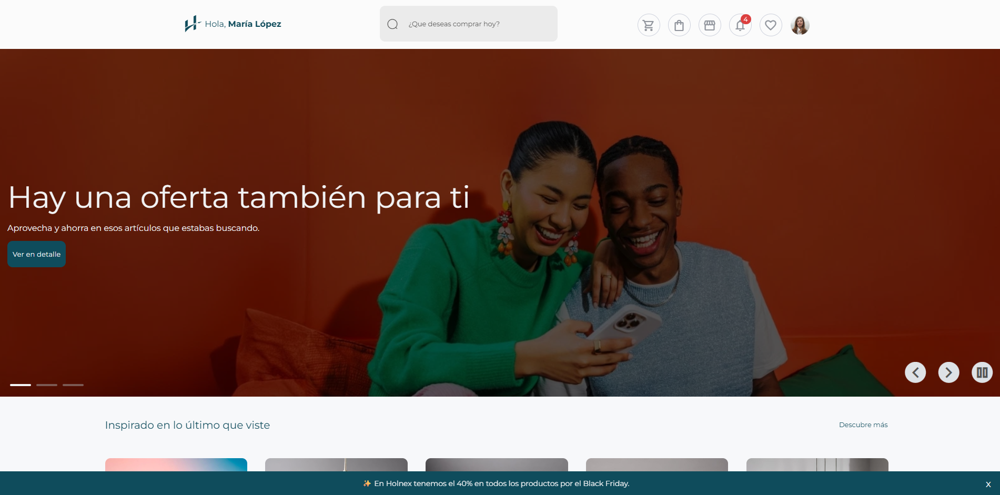
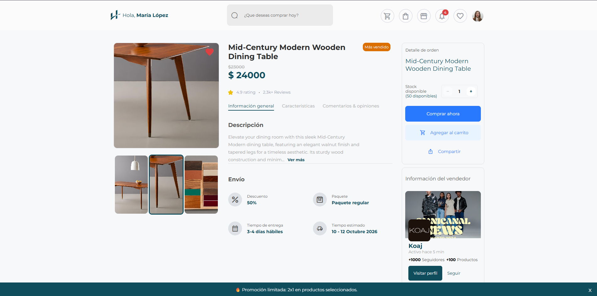
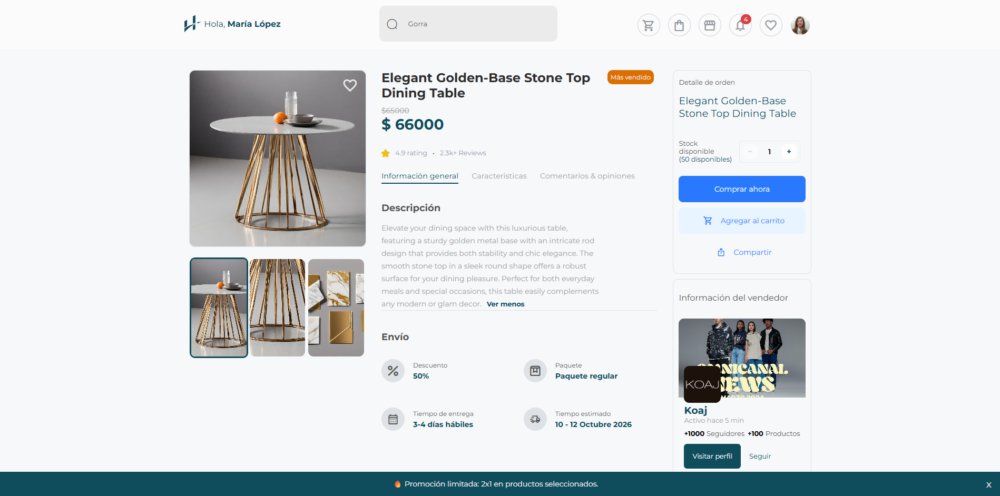
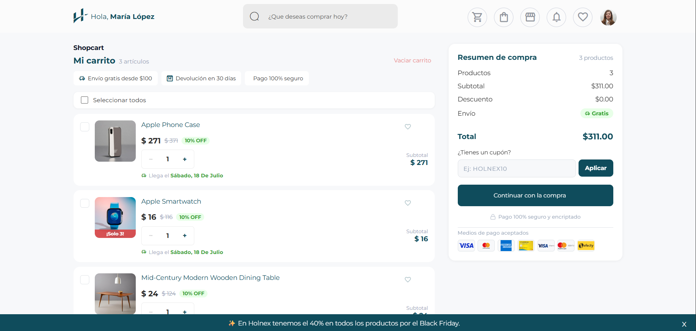

<div align="center">

# Holnex

**Plataforma de comercio electrónico moderna, escalable y con experiencia de usuario de primer nivel.**


</div>

---

> **Nota:** Este proyecto se encuentra en desarrollo activo. Algunas funcionalidades pueden estar incompletas o sujetas a cambios.

---

## Acerca del proyecto

Holnex es una aplicación web de e-commerce construida con Angular y Server-Side Rendering (SSR). Combina la venta de productos con servicios personalizados adaptados a las necesidades de cada usuario. El objetivo es ofrecer una experiencia de compra fluida, accesible y visualmente atractiva.

La arquitectura está diseñada para escalar: módulos lazy-loaded, estado global con NgRx, autenticación con AWS Amplify y un sistema de diseño propio basado en SCSS con soporte para tema claro y oscuro.

---

## Demo

<div align="center">

### Página principal


### Detalle de producto




### Carrito de compras


</div>

---

## Funcionalidades

- **Catálogo de productos** con vista de detalle, galería de imágenes e información del vendedor
- **Carrito de compras** con selector de cantidad, cupones de descuento y resumen de orden
- **Búsqueda** de productos con resultados en tiempo real
- **Autenticación** de usuarios con AWS Amplify (login, registro, recuperación de contraseña)
- **Perfil de usuario** con configuración de cuenta, historial de pedidos y seguridad
- **Navegación por categorías** con breadcrumbs y paginación
- **Tema claro/oscuro** con toggle dinámico
- **Server-Side Rendering (SSR)** para mejor SEO y rendimiento
- **Diseño responsive** optimizado para móvil, tablet y escritorio

---

## Tech Stack

| Capa | Tecnología |
|---|---|
| Framework | Angular 21 |
| Estado global | NgRx (Store, Effects, Entity) |
| Estilos | SCSS + CSS custom properties |
| SSR | Angular SSR + Express |
| Autenticación | AWS Amplify v6 |
| Iconos | Icomoon (fuente personalizada) |
| Programación reactiva | RxJS + Angular Signals |

---

## Instalación

**Requisitos previos:** Node.js 18+ y npm

```bash
# Clonar el repositorio
git clone https://github.com/MauricioMolina12/holnex.git

# Entrar al directorio
cd holnex

# Instalar dependencias
npm install

# Iniciar servidor de desarrollo
npm start
```

La aplicación estará disponible en `http://localhost:4200`.

### Otros comandos

```bash
npm run start\ network     # Servidor accesible en la red local
ng serve -o                # Abrir navegador automáticamente
npm run build              # Build de producción
node dist/holnex/server/server.mjs   # Servir build SSR
```

---

## Arquitectura

```
src/app/
├── core/           # Servicios singleton, guards, interceptores
├── features/       # Módulos de funcionalidad (lazy-loaded)
│   ├── home/
│   ├── products/
│   ├── shopcart/
│   ├── payments/
│   ├── profile/
│   ├── search/
│   └── ...
├── shared/         # Componentes, directivas y pipes reutilizables
├── store/          # Estado global NgRx
├── layout/         # Shell de la aplicación (NavBar, Footer)
└── app.module.ts   # Módulo raíz
```

---

## Estado del proyecto

| Módulo | Estado |
|---|---|
| Home | Activo |
| Productos | Activo |
| Categorías | Activo |
| Carrito de compras | Activo |
| Pagos | En desarrollo |
| Autenticación | Activo |
| Perfil | Activo |
| Búsqueda | Activo |
| Dashboard | En desarrollo |
| Tiendas (sellers) | En desarrollo |

---

## Autor

Desarrollado por **Alfredo Mauricio Molina**.

---

<div align="center">

*Holnex se encuentra en desarrollo activo. Se aceptan sugerencias y feedback.*

</div>
